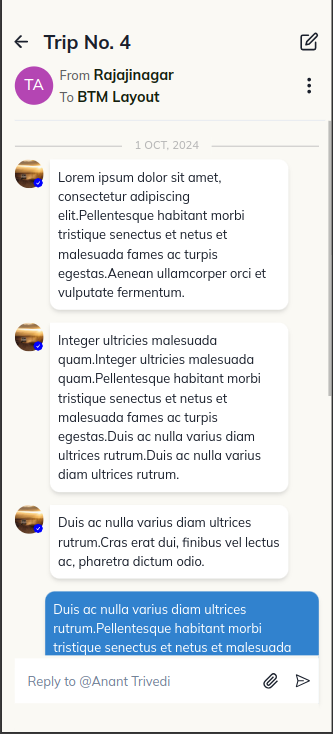

# 🚀 PWA Chat App - Vite Project

Welcome to the **PWA Chat App**! This mini-project is built to demonstrate the power of Progressive Web Apps (PWA) using the blazing-fast **Vite** as a build tool. The app allows users to scroll through chats with smooth pagination and includes metadata from the API, making the entire chat experience dynamic and engaging. Moreover, it works offline as a PWA with installable capabilities! 🎉

## Live Version
[PWA Chat App](https://coriderassignment-anant.vercel.app/)

## ✨ Features

- **Infinite Chat Scrolling**: Fetches older chats as you scroll up.
- **Smooth Pagination**: Loads chats incrementally as you scroll, ensuring smooth performance.
- **PWA Ready**: The app is installable, works offline, and provides a native app-like experience.
- **Metadata Display**: Fetches additional metadata like `from`, `to`, and `status` for the chat, ensuring a more interactive chat UI.

## 📸 Screenshots

  
_A sleek, minimal chat interface with smooth scroll-based chat loading._

## 🛠️ Technology Stack

- **Vite**: A fast and lean build tool that provides instant server start and hot-reloading during development.
- **React**: The UI framework used for building the dynamic components of the chat.
- **Chakra UI**: For clean, responsive, and customizable UI components.
- **Axios**: For handling API requests to fetch the chat data.
- **PWA**: A Progressive Web App setup that allows the app to be installable and functional offline.
- **Typescript**: Ensuring type safety across the entire project.

## 🔧 Getting Started

### Prerequisites

Before you begin, ensure you have the following installed:

- **Node.js**: v18.x or later
- **npm**: v10.x or later
- **Git**: (optional, for version control)

### Installation

1. Clone this repository:
   ```bash
   git clone https://github.com/theananttrivedi/coriderassignment_anant.git
   ```

2. Navigate to the project folder:
   ```bash
   cd coriderassignment_anant
   ```

3. Install the dependencies:
   ```bash
   npm install
   ```

### Local Development

Run the development server using the following command:

```bash
npm run dev
```

Vite will start a local development server at [http://localhost:5173](http://localhost:5173). Open your browser and start exploring the app!

### Building for Production

To build the app for production, use:

```bash
npm run build
```

This will create an optimized production build in the `dist` folder.

### Preview the Production Build

After building, you can preview the production build with:

```bash
npm run preview
```

This will start a local server to serve the production build on [http://localhost:4173](http://localhost:4173).

## 🤝 Contributing

Contributions are welcome! If you have any suggestions or improvements, feel free to submit a pull request or open an issue.

## 📝 License

This project is licensed under the MIT License. See the [LICENSE](LICENSE) file for details.

---

Thank you for checking out the **PWA Chat App**! I hope you enjoy exploring and learning from this project as much as I enjoyed building it. 😊


